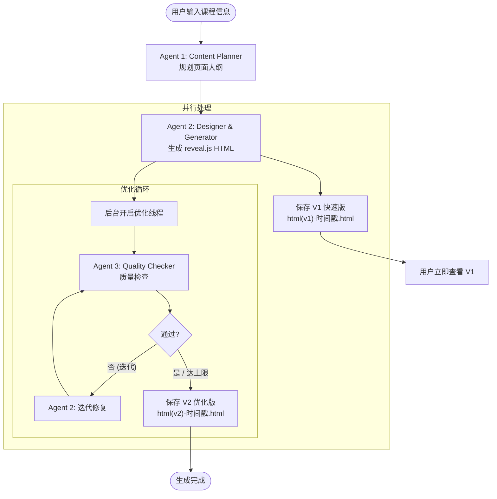

# 🎓 高职教育 PPT 式网页生成器

基于 LangGraph 的多 Agent 协作系统，自动生成精美的 reveal.js PPT 式教学网页。

## 📋 项目概述

本项目使用 **3 个专业 Agent** 协作，将高职教育课程需求转换成精美的 PPT 式网页课件：



## ✨ 核心特性

- ✅ **3 个 Agent 协作**：内容规划 → 设计生成 → 质量检查
- ✅ **专业化配色**：根据专业（机械/3D/烹饪/医护）自动选择配色方案
- ✅ **PPT 式布局**：基于 reveal.js，固定 1920×1080 尺寸，一页一页展示
- ✅ **多种页面类型**：标题页、概念页、图文页、步骤页、警告页、总结页等
- ✅ **质量保证**：自动检查规格、可访问性、教学适配性
- ✅ **反馈优化**：质检发现问题后自动优化（最多 2 轮）
- ✅ **课堂演示友好**：大字体、高对比度、投影仪友好

## 🏗️ 系统架构

### Agent 分工

| Agent | 职责 | 输入 | 输出 | 平均耗时 |
|-------|-----|------|------|---------|
| **Agent 1: Content Planner** | 内容规划 | 课程信息 | 页面大纲（JSON） | 5-8 秒 |
| **Agent 2: Designer & Generator** | 设计+生成 | 页面大纲 | reveal.js HTML | 15-20 秒 |
| **Agent 3: Quality Checker** | 质量检查+优化 | HTML 代码 | 检查结果/优化版本 | 8-10 秒 |

**总耗时**：约 30-40 秒（包含优化）

### 技术栈

- **框架**: LangGraph (Agent 协作)
- **LLM**: OpenAI API / 兼容接口（如 DeepSeek）
- **前端**: reveal.js 4.x (PPT 式网页框架)
- **语言**: Python 3.8+

## 🚀 快速开始

### 1. 安装依赖

```bash
pip install -r requirements.txt
```

### 2. 配置环境变量

复制 `.env.example` 为 `.env`，填写你的 API 信息：

```bash
cp .env.example .env
```

编辑 `.env`：

```env
# OpenAI API 配置（或兼容接口）
OPENAI_API_KEY=your_api_key_here
OPENAI_BASE_URL=https://api.openai.com/v1  # 或其他兼容接口

# 模型配置
MODEL_NAME=gpt-4  # 或 deepseek-chat
TEMPERATURE=0.7
```

### 3. 运行程序

```bash
python main.py
```

### 4. 输入课程信息

程序会依次提示输入：

```
📚 课程主题（如：机械加工-车床操作）:
🎯 专业（如：机械制造）:
👥 授课对象（如：高职二年级学生）:
⏰ 课时（如：45分钟）:
📌 关键知识点（用逗号分隔，可选）:
```

> 所有输入都可以直接回车使用默认值进行测试。

### 5. 查看结果

生成的 HTML 文件保存在 `output/` 目录：

```bash
output/ppt_web_20260105_143022.html
```

**使用方法**：
1. 用浏览器打开生成的 HTML 文件
2. 按 **F11** 进入全屏模式（PPT 演示模式）
3. 使用 **← → 方向键**或**空格键**翻页
4. 按 **Esc** 退出全屏

## 📂 项目结构

```
agent2html/
├── main.py                          # 主程序入口
├── requirements.txt                 # 依赖包列表
├── .env.example                     # 环境变量示例
├── README.md                        # 项目文档
│
├── src/
│   ├── state.py                     # State 定义（PPTWebState）
│   ├── workflow.py                  # LangGraph 工作流定义
│   │
│   └── agents/
│       ├── content_planner.py       # Agent 1: 内容规划
│       ├── designer_generator.py    # Agent 2: 设计+生成
│       └── quality_checker.py       # Agent 3: 质量检查
│
└── output/                          # 生成的 HTML 文件目录
```

## 🎨 配色方案

系统根据专业自动选择配色：

| 专业类别 | 主色 | 辅色 | 强调色 |
|---------|-----|------|--------|
| **机械类** | 深蓝 #2c3e50 | 灰色 #34495e | 橙色 #e67e22 |
| **3D/设计类** | 紫色 #8e44ad | 青色 #3498db | 黄色 #f39c12 |
| **烹饪类** | 暖橙 #e67e22 | 棕色 #a0522d | 红色 #e74c3c |
| **医护类** | 绿色 #27ae60 | 青绿 #16a085 | 红色 #e74c3c |

## 📄 页面类型

系统支持 8 种页面类型：

| 类型 | 说明 | 适用场景 |
|-----|------|---------|
| **title** | 标题页 | 课程名称 + 教学目标 |
| **concept** | 概念讲解页 | 定义、原理说明 |
| **image_text** | 图文并茂页 | 左文右图或上图下文 |
| **steps** | 步骤说明页 | 操作流程、顺序说明 |
| **comparison** | 对比页 | 表格、对比图 |
| **warning** | 警告/注意事项页 | 安全提示（红色边框） |
| **summary** | 总结页 | 知识回顾、思考题 |
| **case_study** | 案例分析页 | 实际案例讲解 |

## 🔧 自定义配置

### 修改配色方案

编辑 `src/agents/designer_generator.py` 中的 `COLOR_SCHEMES`：

```python
COLOR_SCHEMES = {
    "你的专业": {
        "primary": "#颜色代码",
        "secondary": "#颜色代码",
        "accent": "#颜色代码",
        "background": "#颜色代码",
        "text": "#颜色代码"
    }
}
```

### 修改最大迭代次数

编辑 `src/workflow.py` 和 `src/agents/quality_checker.py` 中的 `MAX_ITERATIONS`：

```python
MAX_ITERATIONS = 2  # 改为你想要的次数
```

## 🛠️ 使用示例

### 示例 1：机械加工课程

```
课程主题: 机械加工-车床操作
专业: 机械制造
授课对象: 高职二年级学生
课时: 45分钟
关键知识点: 车床结构, 操作步骤, 安全规范
```

**生成效果**：
- 8-10 页 PPT 式网页
- 蓝灰色工业风配色
- 包含车床结构图、操作步骤（大号数字）、红色安全警告框

### 示例 2：3D 建模课程

```
课程主题: 3D建模基础-Blender入门
专业: 数字媒体艺术
授课对象: 高职一年级学生
课时: 90分钟
关键知识点: 界面介绍, 基础建模, 材质贴图
```

**生成效果**：
- 10-15 页网页
- 紫青色科技风配色
- 包含界面截图、分步教程、对比图

## 📊 质量检查项

Agent 3 会自动检查以下内容：

### 规格检查
- ✅ 页面数量是否正确
- ✅ 尺寸是否为 1920×1080
- ✅ 字体是否够大（≥ 32px）

### reveal.js 规范
- ✅ 是否有 reveal 容器
- ✅ 是否有初始化代码
- ✅ 是否引入 CDN

### 可访问性
- ✅ 图片是否有 alt 属性
- ✅ 是否有标题标签

### 教学适配性（LLM 检查）
- ✅ 配色是否符合专业特点
- ✅ 对比度是否够高
- ✅ 排版是否清晰

## 🐛 常见问题

### 1. API 调用失败

**问题**：`openai.error.AuthenticationError`

**解决**：检查 `.env` 文件中的 `OPENAI_API_KEY` 是否正确

### 2. 生成的页面数量不对

**原因**：LLM 可能没有严格遵守指令

**解决**：Quality Checker 会自动检测并优化（最多 2 轮）

### 3. 字体太小

**原因**：LLM 生成的 CSS 不符合规范

**解决**：Quality Checker 会自动检测并优化

### 4. 中文显示乱码

**解决**：确保 HTML 文件保存时使用 UTF-8 编码（代码已处理）

## 🎯 后续优化方向

### 短期（1-2 周）
- [ ] 添加更多专业配色方案
- [ ] 支持更多页面布局类型
- [ ] 优化 Prompt，提高生成质量
- [ ] 添加图片 placeholder 自动替换（AI 生成图片）

### 中期（1 个月）
- [ ] 集成 RAG 素材库（复用精美 PPT 的图片）
- [ ] 添加 Image Matcher Agent（第 4 个 Agent）
- [ ] 支持用户自定义风格偏好
- [ ] 添加导出 PDF 功能

### 长期（2-3 个月）
- [ ] 支持从 PPT 文件导入内容（反向工程）
- [ ] 支持多语言版本（中英双语）
- [ ] 添加 Web 界面（Flask/FastAPI）
- [ ] 支持在线编辑和预览

## 📚 相关技术文档

- [LangGraph 官方文档](https://langchain-ai.github.io/langgraph/)
- [reveal.js 官方文档](https://revealjs.com/)
- [OpenAI API 文档](https://platform.openai.com/docs/api-reference)

## 📝 开源协议

MIT License

---

**开发者**: bisuv
**项目**: agent2html
**日期**: 2026-01-05